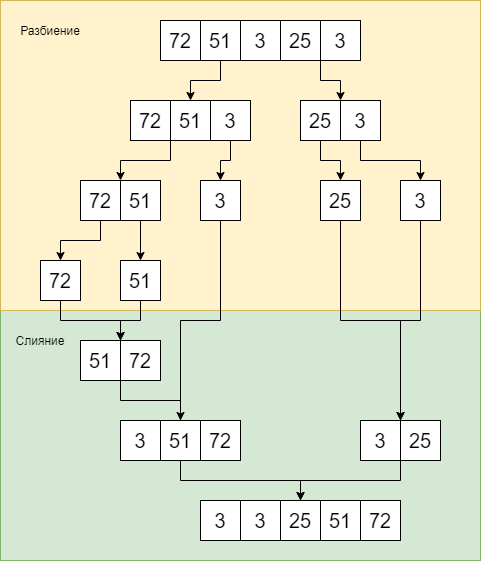

# Сортировка слиянием / Merge sort
Еще один "разделяй и властвуй" алгоритм. Более простой пример: [вычисление чисел Фибоначчи](../RecursionFibonacci/fibonacci.md).

## Общая идея
Задача сортировки массива дробится до тривиального случая сортировки: пустого массива или массива из одного элемента. Достигается это разбиением полученного массива на две части по центру, пока от массива не останется либо ничего, либо 1 элемент. После этого нужно соединить два полученных отсортированных массива.

Для этого сравниваем первые элементы этих массивов и берем минимальный. Записываем этот элемент в результирующий массив. Повторяем пока оба массива не станут пустыми. Учитывая что мы сливаем отсортированные массивы, то можно сравнивать только их первые (в текущией итерации) элементы.

Ниже разбираются конкретные части алгоритма.

### Слияние двух отсортированных массивов


Сравниваются первые (желтые) элементы входных массивов. Минимальный элемент записывается в результирующий массив.

### Сортировка


## Псевдокод
```
// array - сортируемый массив
// lowIndex, topIndex - границы подмассива, на котором выполняется текущий шаг алгоритма
MergeSort(array, lowIndex, topIndex):
    // Если выполняется данное условие то в текущем подмассиве 0 или 1 элемент
    // Массив из 0 или 1 элемента уже отсортирован
    if(lowIndex >= topIndex)
        return
        
    // Делим массив на 2 подмассива в центре и сортируем их
    middleIndex = (lowIndex + topIndex)  
    MergeSort(array, lowIndex, middleIndex)   
    MergeSort(array, middleIndex + 1, topIndex)
    
    // Соединяем 2 отсортированных подмассива
    Merge(array, lowIndex, middleIndex, topIndex)
```
```
// array - сортируемый массив
// lowIndex, topIndex - граница массива, из которого получили 2 подмассива
// middleIndex - точка в которой массив был разделен на 2 подмассива
Merge(array, lowIndex, middleIndex, topIndex):
    // Создаем подмассивы
    n1 = lowIndex + middleIndex
    n2 = middleIndex + 1 + topIndex
    leftArray = new Array[n1]    
    rightArray = new Array[n2]
    
    // Копируем в подмассивы значения из оригинального массива
    for i = 0 to n1 - 1
        leftArray[i] = array[lowIndex + i];
    for j = 1 to n2
        rightArray[j] = array[middleIndex + i];    
        
    i = j = 1
    k = lowIndex
    
    // Итерируемся по подмассивам и записываем в массив наименьшие значения
    while i <= n1 and j <= n2
        if leftArray[i] <= rightArray[j]
            array[k] = leftArray[i]
            i++
        else
            array[k] = rightArray[j]
            j++
        k++
        
    // Если остался "хвост" у левого подмассива то записываем его в массив
    while i <= n1
        array[k] = leftArray[i]
        i++
        k++
    
    // Если остался "хвост" у правого подмассива то записываем его в массив    
    while j <= n2
        array[k] = rightArray[i]
        j++
        k++
```
## Реализация на С#
```
public static class MergeSort
    {
        public static void Sort(int[] array)
        {
            Sort(array, 0, array.Length - 1);
        }

        private static void Sort(int[] array, int low, int high)
        {
            if(low >= high)
                return;

            var pivot = (low + high) / 2;
            Sort(array, low, pivot);
            Sort(array, pivot + 1, high);
            Merge(array, low, pivot, high);
        }

        private static void Merge(int[] array, int low, int pivot, int high)
        {
            var left = new int[pivot - low + 1];
            var right = new int[high - pivot];
            
            for (int i = 0; i < left.Length; i++)
            {
                left[i] = array[low + i];
            }
            
            for (int j = 0; j < right.Length; j++)
            {
                right[j] = array[pivot + j + 1];
            }

            int leftIndex = 0;
            int rightIndex = 0;
            int k = low;

            while (leftIndex < left.Length && rightIndex < right.Length)
            {
                if (left[leftIndex] <= right[rightIndex])
                {
                    array[k] = left[leftIndex];
                    leftIndex++;
                }
                else
                {
                    array[k] = right[rightIndex];
                    rightIndex++;
                }
                k++;
            }

            while (leftIndex < left.Length)
            {
                array[k] = left[leftIndex];
                leftIndex++;
                k++;
            }
            
            while (rightIndex < right.Length)
            {
                array[k] = right[rightIndex];
                rightIndex++;
                k++;
            }
        }
    }
```
